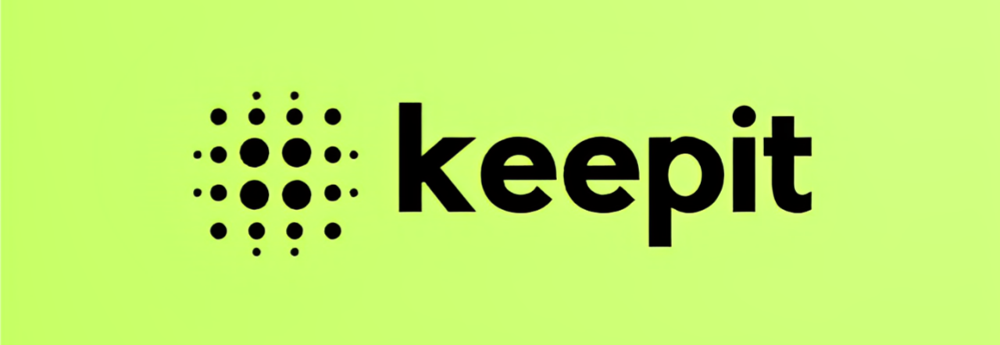

# KeepIt — Minimalist Message Bookmarking for Discord

**KeepIt** is a minimalist Discord bot that lets you bookmark messages with a single click. Organize saved content into categories, add custom tags, and access everything directly from your DMs — all through simple and intuitive interactions. Current version: 1.0.0

## Last Changes

### Version 1.0.0
- Official release of KeepIt.
- Improved bookmark search functionality with tag-based filtering.
- Enhanced performance and reduced response times.
- Updated documentation with a comprehensive user guide.
- Minor bug fixes and stability improvements.
- The bot is now available as a user-installable application.

### Version 0.9.6
- Minor bug fixes and performance improvements.

### Version 0.9.4 & 0.9.5
- Enhanced user experience with cleaner UI and faster response times.
- Minor bug fixes and performance improvements.
- Updated documentation for better clarity.

### Version 0.9.3
- Added `/status` command to check bot status, ping, and uptime.
- Improved bookmark management with interaction-based buttons.
- Enhanced user experience with cleaner UI and faster response times.
- Minor bug fixes and performance improvements.
- Updated documentation for better clarity.

**Tagline:** _Keep it. Tag it. Find it._

---

## Features

- Bookmark messages from any server using a context menu command.
- Organize saved messages with custom categories and tags.
- Manage your bookmarks with interaction-based buttons.
- View message details such as content, author, and timestamp.
- Clean, user-first experience — no clutter, no database required.

---

## Commands

| Command       | Description                                               |
|---------------|-----------------------------------------------------------|
| `/help`       | Provides support and external resources.                  |
| `/guide`      | Learn how to use the bot step by step.                   |
| `/bookmark`   | Save a message to your DMs, with optional tags.          |
| `/delete`     | Delete a saved bookmark.                                 |
| `/terms`      | View the Terms of Service.                               |
| `/privacy`    | View the Privacy Policy.                                 |
| `/status`     | View the bot’s current status, ping, and uptime.         |

You can also right-click any message and choose **“Bookmark with KeepIt”**.

---

## Required Permissions

To function properly, the bot requires:

- Read Message History
- Use Application Commands

## Invite KeepIt to Your Server

Ready to start bookmarking messages?  
[Click here to invite KeepIt to your server!](https://discord.com/discovery/applications/1358479024699212040)

---

## License

This project is licensed under the [Creative Commons Attribution-NonCommercial-NoDerivatives 4.0 International License](https://creativecommons.org/licenses/by-nc-nd/4.0/).

© 2025 Sébastien  
You may view and fork this project for non-commercial purposes only. Redistribution, modification, or use in commercial projects is not permitted.

See the [LICENSE](./LICENSE.md) file for full terms.

---

## Support

Need help or have feedback?  
Use the `/help` command for links to documentation and support resources.

---

Built with care by **Sébastien (@striatp)**
